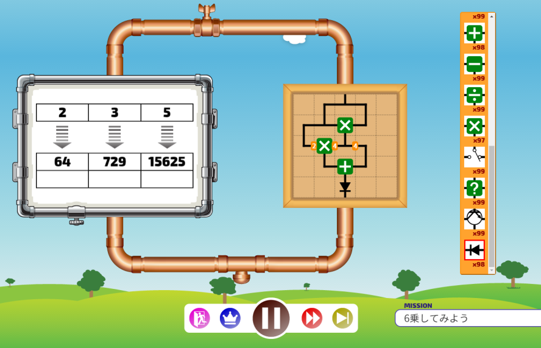

# MNEMO

[![Build Status][travis-image]][travis-url]
[![Coverage Status][coveralls-image]][coveralls-url]

[travis-url]: https://travis-ci.org/tsg-ut/mnemo
[travis-image]: https://travis-ci.org/tsg-ut/mnemo.svg?branch=master
[coveralls-url]: https://coveralls.io/github/tsg-ut/mnemo?branch=master
[coveralls-image]: https://coveralls.io/repos/github/tsg-ut/mnemo/badge.svg?branch=master

[](http://sig.tsg.ne.jp/mnemo/)

MNEMOは、TSGが制作しているプログラミング風ゲームです。

## **[最新ビルド](http://sig.tsg.ne.jp/mnemo/)**

## 開発に必要なもの

* Node.js v6

## 開発環境のセットアップ

```sh
git clone https://github.com/tsg-ut/mnemo.git
cd mnemo
npm install
```

## ビルド

### 全部ビルド

```sh
npm run build
```

### JavaScriptだけビルド

```sh
npm run browserify
```

### HTMLだけビルド

```sh
npm run pug
```

### CSSだけビルド

```sh
npm run less
```

### 自動リビルド

```sh
npm run watch
```

## テスト

### 全部テスト

```sh
npm test
```

### ユニットテストだけ実行

```sh
npm run unit
```

### 機能テストだけ実行

```sh
npm run functional
```
